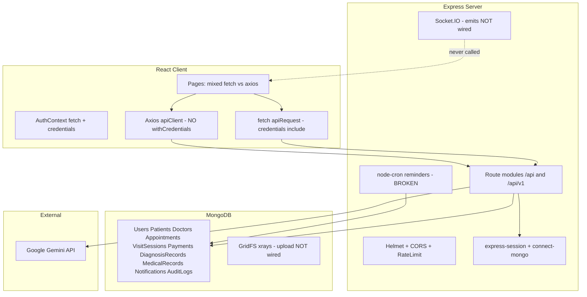

# Dento-HealthCare Production Readiness Audit

**Verdict: NOT PRODUCTION-READY**

This is an investor-grade technical due diligence assessment based on full reverse-engineering of the monorepo at [`d:\Ptoject Versions\احتياطي\test for new repo\Dento-HealthCare`](d:\Ptoject Versions\احتياطي\test for new repo\Dento-HealthCare). Primary documentation lives in [`dento.md`](dento.md); there is no root README, no `docs/`, no CI, and no automated tests.

---

## 1. System Understanding (Architect Reconstruction)

### Stack and entry points

| Layer | Technology | Entry |
|-------|------------|-------|
| Backend | Node 20, Express, Mongoose, Socket.IO, node-cron, Winston | [`server/index.ts`](server/index.ts) |
| Frontend | React 18, Vite, Wouter, TanStack Query, shadcn/ui | [`client/src/App.tsx`](client/src/App.tsx) |
| Database | MongoDB 7 (sessions in `sessions`, files in GridFS `xrays`) | [`server/db/connection.ts`](server/db/connection.ts) |
| AI | Google Gemini `gemini-2.5-flash` via `@google/generative-ai` | [`server/routes/ai.routes.ts`](server/routes/ai.routes.ts) |
| Deploy | Docker multi-stage + docker-compose | [`Dockerfile`](Dockerfile), [`docker-compose.yml`](docker-compose.yml) |

### Architecture diagram

### Authentication flow (verified)

- **Mechanism:** Cookie-based `express-session` stored in MongoDB (`connect-mongo`), 7-day TTL, `httpOnly`, `secure` in production, `sameSite: none` in prod.
- **Passwords:** bcrypt, 10 rounds ([`server/services/auth.service.ts`](server/services/auth.service.ts)).
- **Login:** email OR username; session regeneration on success ([`server/routes/auth.routes.ts`](server/routes/auth.routes.ts):117-131).
- **Client auth:** [`client/src/contexts/AuthContext.tsx`](client/src/contexts/AuthContext.tsx) uses `fetch('/api/auth/me', { credentials: 'include' })` — correct.
- **No JWT, no MFA, no user self-service password reset.**

### Authorization / RBAC (verified)

Roles: `patient`, `doctor`, `student`, `graduate`, `admin` ([`server/middleware/auth.ts`](server/middleware/auth.ts)).

Middleware: `requireAuth`, `requireRole`, `requireAdmin`, `requireDoctor`, `requireMedicalStaff`, helper `canAccessPatient()`.

**Critical inconsistency:** `validatePatientAccess` middleware is defined but **never attached to any route** (grep shows zero usage). Medical records/medications endpoints use only `requireAuth`.

### Data flows traced

| Flow | Path | Status |
|------|------|--------|
| Login | LoginPage → POST `/api/auth/login` → session cookie → AuthContext refetch | Working |
| Book appointment | AppointmentBookingPageNew → POST `/api/appointments` → conflict check → NotificationService → optional AI treatment plan | Partially working |
| Mark attended | POST `/api/appointments/:id/mark-attended` → VisitSession → Payment pending → notification | Backend logic exists; no DB transaction |
| Record payment | POST `/api/payments` (doctor only) | Manual ledger only |
| AI diagnosis | AIDiagnosisPage → `apiPost('/v1/ai/diagnosis')` → Gemini → DiagnosisRecord | **Broken prompt + likely 401 via Axios** |
| AI chat | ChatbotCore → POST `/api/ai/chat` (public) | Works but unauthenticated |
| Notifications | NotificationService → MongoDB; client polls REST | Create on events works; cron broken; WebSocket unused |
| X-ray storage | Base64 in JSON body; GridFS upload imported but never called | Images not persisted to GridFS |
| Admin panel | AdminPanelPage calls `/api/v1/admin/*` via fetch+credentials | **Page not routed in App.tsx** |

### API surface

~70 endpoints across 11 route modules mounted at both `/api/v1` and `/api` ([`server/routes/index.ts`](server/routes/index.ts)). Full map documented in backend exploration; no separate BFF.

### Frontend route map (verified in [`client/src/App.tsx`](client/src/App.tsx))

| Route | Protection | Backend wired? |
|-------|------------|----------------|
| `/home`, `/clinics`, `/clinic/:id` | Auth gate only (login wall) | Clinics: yes |
| `/appointments`, `/my-appointments` | PatientRoute | Yes |
| `/today-appointments`, `/patients` | MedicalStaffRoute | Yes |
| `/price-management` | DoctorOnlyRoute | Yes |
| `/ai-diagnosis` | **None** (any logged-in role) | Broken integration |
| `/diagnosis-history` | PatientRoute | Partial (axios) |
| `/medical-records` | **None** | Broken integration (axios) |
| `/payment` | PatientRoute | **Mock data only** |
| `/support-tickets`, `/financial`, `/search`, `/reports` | **None** | **100% mock/hardcoded** |
| `/admin-panel` | N/A | **Imported but NO Route — unreachable** |
| `/treatment-plans` | None | **Hardcoded mock steps** |

### Dual API client problem (verified)

- **fetch layer** ([`client/src/lib/queryClient.ts`](client/src/lib/queryClient.ts)): `credentials: "include"` — works with session auth.
- **Axios layer** ([`client/src/services/api/client.ts`](client/src/services/api/client.ts)): **no `withCredentials: true`**; interceptor injects `Bearer` token from `localStorage.authToken` which the server **does not use**.

Pages using Axios for protected endpoints: `AIDiagnosisPage`, `MedicalRecordsPage`, `DiagnosisHistoryPage`, `PatientList`, `HomePage`, etc. These will receive **401 Unauthorized** in production for authenticated operations.

---

## 2. Issue Register (Classified)

### CRITICAL

#### C1 — PHI IDOR: Medical records readable by any authenticated user
- **Description:** `GET /patients/:id/medical-records` and `GET /patients/:id/medications` only use `requireAuth`, not `canAccessPatient` ([`server/routes/patients.routes.ts`](server/routes/patients.routes.ts):235-264).
- **Why it matters:** Any logged-in patient/student can enumerate patient IDs and read other patients' clinical records — direct HIPAA-equivalent violation.
- **Risk:** Critical
- **Solution:** Apply `validatePatientAccess('id')` or inline `canAccessPatient` on all PHI read/write endpoints.
- **Effort:** 1–2 days (including audit of all similar endpoints)

#### C2 — PHI IDOR: AI diagnosis history queryable by any userId
- **Description:** `GET /ai/diagnosis/patient/:userId` checks role but not doctor-patient relationship ([`server/routes/ai.routes.ts`](server/routes/ai.routes.ts):280-299).
- **Why it matters:** Any student/doctor can pull diagnosis records for arbitrary users.
- **Risk:** Critical
- **Solution:** Verify assignment/appointment relationship before returning records.
- **Effort:** 1 day

#### C3 — Hardcoded production credentials in repository
- **Description:** [`server/db/seed.ts`](server/db/seed.ts):45-50 contains plaintext admin password `02115510Aa**#` and real email committed to git.
- **Why it matters:** Credential exposure in source control is an immediate breach vector if seed is run in any shared/staging/prod environment.
- **Risk:** Critical
- **Solution:** Remove credentials from code; use env vars; rotate compromised password; add seed guards for non-dev environments.
- **Effort:** 4 hours

#### C4 — AI diagnosis prompt does not receive patient data
- **Description:** Prompt template uses escaped literals `\${clinicMappings}` and `\${description}` ([`server/routes/ai.routes.ts`](server/routes/ai.routes.ts):411-414). No `description` variable is defined anywhere in the file (grep: zero matches). Gemini receives placeholder text, not symptoms/answers.
- **Why it matters:** Core product feature produces diagnoses without actual patient input — clinically unsafe and functionally broken.
- **Risk:** Critical
- **Solution:** Build `description` from `answers`/`symptomSummary`; use `${clinicMappings}` and `${description}` without escaping.
- **Effort:** 4–8 hours

#### C5 — Axios client cannot authenticate session-protected endpoints
- **Description:** Axios has no `withCredentials`; server uses cookies only. Protected pages (`AIDiagnosisPage`, `MedicalRecordsPage`) use `apiPost`/`apiGet`.
- **Why it matters:** Key clinical workflows fail silently or with 401 in real usage.
- **Risk:** Critical
- **Solution:** Add `withCredentials: true` to Axios; remove dead Bearer token logic; standardize on one HTTP client.
- **Effort:** 1–2 days

#### C6 — Zero automated tests and zero CI/CD
- **Description:** No test files, no test runner in [`package.json`](package.json), no `.github/workflows/`.
- **Why it matters:** No regression safety net for PHI, payments, or auth — unacceptable for healthcare production.
- **Risk:** Critical
- **Solution:** Add CI pipeline (lint, typecheck, unit + integration tests for auth/RBAC/appointments/payments).
- **Effort:** 2–3 weeks for meaningful baseline

#### C7 — No medical data privacy / compliance framework
- **Description:** No HIPAA, GDPR, PHI handling, retention, breach notification, or BAA documentation anywhere in repo.
- **Why it matters:** Cannot legally/market as healthcare-grade without documented controls and risk assessment.
- **Risk:** Critical (for regulated launch)
- **Solution:** Privacy policy, data retention policy, access audit review, encryption-at-rest assessment, DPIA.
- **Effort:** 3–6 weeks (legal + engineering)

---

### HIGH

#### H1 — Unauthenticated AI chat endpoint
- **Evidence:** [`server/routes/ai.routes.ts`](server/routes/ai.routes.ts):100 — no `requireAuth`.
- **Why:** Gemini quota/cost abuse; unauthenticated medical advice liability.
- **Solution:** Require auth (or CAPTCHA + stricter rate limits for anonymous).
- **Effort:** 4 hours

#### H2 — Deactivated users can still log in
- **Evidence:** `isActive` on User model; login in [`auth.routes.ts`](server/routes/auth.routes.ts) never checks it; `UserRepo.findByEmailOrUsername` does not filter `isActive`.
- **Solution:** Block login when `!user.isActive || user.deletedAt`.
- **Effort:** 2 hours

#### H3 — Students have excessive PHI read access
- **Evidence:** Students get full patient list ([`patients.routes.ts`](server/routes/patients.routes.ts):32), all visit sessions ([`payments.routes.ts`](server/routes/payments.routes.ts):20), all payments (:89).
- **Solution:** Scope student access to assigned patients/clinic per business rules.
- **Effort:** 2–3 days

#### H4 — Payment UI is entirely mock; misleads users
- **Evidence:** [`client/src/pages/PaymentPageNew.tsx`](client/src/pages/PaymentPageNew.tsx):40-65 — hardcoded invoices; fake card form with no backend.
- **Why:** Patients see payment flows that do not reflect real balances from `/patient/:id/balance`.
- **Solution:** Wire to `/payments/patient/:id`, `/patient/:id/balance`; remove fake card processing or integrate real gateway.
- **Effort:** 3–5 days (ledger only); 2–4 weeks (Stripe)

#### H5 — Payment balance counts pending as paid
- **Evidence:** [`server/storage.ts`](server/storage.ts):292-294 and [`payment.repo.ts`](server/repositories/payment.repo.ts):81-82 sum all payments regardless of `status`.
- **Why:** Financial reports and patient balances are wrong.
- **Solution:** Filter `status: 'paid'` for `totalPaid`.
- **Effort:** 2 hours

#### H6 — Cron appointment reminders completely broken
- **Evidence:** [`server/services/cron.service.ts`](server/services/cron.service.ts):33 calls `NotificationService.create()` which does not exist; uses invalid type `appointment_reminder` (schema allows `reminder` only per [`notification.model.ts`](server/models/notification.model.ts):23).
- **Solution:** Add `onAppointmentReminder()` to NotificationService; add `reminderSent` flag on appointments.
- **Effort:** 1 day

#### H7 — WebSocket real-time layer is dead code
- **Evidence:** `emitNotification`/`emitAppointmentUpdate` defined in [`server/websocket.ts`](server/websocket.ts) but never called from routes/services; [`useWebSocket.ts`](client/src/hooks/useWebSocket.ts) never imported.
- **Solution:** Wire emits in NotificationService or remove WebSocket until needed.
- **Effort:** 2–3 days to wire properly

#### H8 — Background AI treatment plan notifications broken
- **Evidence:** [`server/services/ai-treatment.service.ts`](server/services/ai-treatment.service.ts):85 calls nonexistent `NotificationService.create()`.
- **Effort:** 2 hours

#### H9 — No database transactions for multi-step financial workflows
- **Evidence:** `mark-attended` creates VisitSession + Payment + updates Appointment without Mongo transaction ([`appointments.routes.ts`](server/routes/appointments.routes.ts):229-244).
- **Why:** Partial failures → inconsistent ledger (session without payment or duplicate on race).
- **Solution:** `mongoose.startSession()` transaction wrapper; idempotency key on mark-attended.
- **Effort:** 2–3 days

#### H10 — GridFS X-ray persistence not implemented
- **Evidence:** `uploadToGridFS` imported in ai.routes but never invoked; `xrayFileId` always null; ownership check on GET `/ai/xray/:fileId` ineffective.
- **Solution:** Upload validated images to GridFS with `metadata.userId`; store fileId on DiagnosisRecord.
- **Effort:** 2–3 days

#### H11 — Admin panel unreachable
- **Evidence:** `AdminPanelPage` imported in App.tsx:33 but no `<Route path="/admin-panel">` in Switch; not in sidebar.
- **Solution:** Add `AdminRoute` wrapper and navigation entry.
- **Effort:** 4 hours

#### H12 — No CSRF protection on session-authenticated mutations
- **Evidence:** Cookie-based auth with no CSRF token middleware.
- **Why:** Cross-site request forgery can trigger state-changing operations if user is logged in.
- **Solution:** `csurf` or double-submit cookie pattern for POST/PUT/DELETE.
- **Effort:** 2–3 days

#### H13 — No payment gateway integration
- **Evidence:** Stripe commented in [`.env.example`](.env.example); Payment model is manual ledger only.
- **Why:** "Payment page" implies online payment; currently manual cash/card recording by doctor only.
- **Effort:** 2–4 weeks for Stripe integration

---

### MEDIUM

| ID | Issue | Why it matters | Solution | Effort |
|----|-------|----------------|----------|--------|
| M1 | `validatePatientAccess` middleware unused | RBAC helper exists but not enforced | Attach to all patient-scoped routes | 1 day |
| M2 | API response logging may leak PHI | [`server/index.ts`](server/index.ts):155-157 logs JSON bodies | Redact sensitive fields; structured logging | 1 day |
| M3 | Rating `patientId` stores `userId` | Semantic mismatch in ratings repo/routes | Normalize to patient record ID | 1 day |
| M4 | Admin password reset min 6 chars vs register min 8+complexity | Weaker admin-set passwords | Align validation schemas | 2 hours |
| M5 | Multiple nav pages are mock (Search, Financial, Support, Reports, Treatment Plans) | Users see non-functional features as real | Hide until wired or add "demo" badges | 2–5 days |
| M6 | `docker-compose.yml` prod `app` service missing `ALLOWED_ORIGINS` | CORS may block or misconfigure in container deploy | Add required env vars | 2 hours |
| M7 | MongoDB port 27017 exposed in compose | Dev DB attack surface | Bind to internal network only in prod | 2 hours |
| M8 | Stale `db:push` drizzle script, unused `@types/pg` | Developer confusion, broken scripts | Remove dead dependencies/scripts | 2 hours |
| M9 | Audit logs TTL 90 days | May be insufficient for compliance investigations | Configurable retention per policy | 1 day |
| M10 | No email/SMS notification channel | Appointment reminders rely on in-app polling only | SMTP/Twilio integration | 1–2 weeks |
| M11 | No user password reset flow | Locked-out patients require admin intervention | Forgot-password with secure token | 3–5 days |
| M12 | Appointment model lacks `duration` field | Conflict detection uses default 30 min only | Add duration to schema and booking UI | 2 days |
| M13 | AI diagnosis accessible to all roles on frontend | No `MedicalStaffRoute` on `/ai-diagnosis` | Align UI RBAC with intended policy | 4 hours |
| M14 | `GET /ratings` fully public | May expose patient comments | Auth or anonymize | 4 hours |

---

### LOW

| ID | Issue | Solution | Effort |
|----|-------|----------|--------|
| L1 | `useWebSocket` hook unused | Remove or integrate | 2 hours |
| L2 | Unused passport/openid deps in package.json | Remove | 1 hour |
| L3 | Package name `rest-express` (template leftover) | Rename | 1 hour |
| L4 | No root README | Add pointer to dento.md | 2 hours |
| L5 | DentocadPage is marketing placeholder | Label as roadmap | 1 hour |
| L6 | Replit vite plugins in devDependencies | Remove if not used | 1 hour |
| L7 | `tsconfig.json` references nonexistent `shared/` | Clean tsconfig | 30 min |
| L8 | Validation middleware logs full request body on failure | Redact in production | 2 hours |

---

## 3. Cross-Check Consistency Notes

- **Auth story is internally inconsistent:** Server = session cookies; Axios client = Bearer token (unused) without cookies. This explains why some "wired" pages still fail in practice.
- **RBAC is partially implemented:** `canAccessPatient` works on `GET /patients/:id` but not on medical records, medications, or AI diagnosis history — same data class, different enforcement.
- **Notification architecture is half-built:** Event-driven `NotificationService` methods work for appointments; cron and AI-treatment call a nonexistent `create()` method; WebSocket emits exist but are never invoked.
- **Payment story is split:** Backend ledger (visit → pending payment → doctor records paid) is real; frontend payment page is fictional — a user testing end-to-end will conclude payments are broken.
- **AI safety controls exist on paper** (disclaimers, rate limits, Zod validation, `requiresHumanReview`) **but the diagnosis prompt bug (C4) bypasses the entire value chain.**

---

## 4. Production Readiness Summary

### Launch blockers (cannot ship)

1. C1 — Medical records/medications IDOR
2. C2 — AI diagnosis history IDOR
3. C3 — Hardcoded admin credentials in repo
4. C4 — Broken AI diagnosis prompt (no patient data sent to model)
5. C5 — Axios session auth failure on protected clinical pages
6. C6 — No tests / no CI/CD
7. C7 — No privacy/compliance framework (if launching as healthcare product)

### Must fix before MVP launch

1. H1 — Authenticate AI chat or restrict abuse
2. H2 — Block inactive/deleted user login
3. H4 — Wire payment page to real balance/invoice APIs (or remove from nav)
4. H5 — Fix balance calculation (pending vs paid)
5. H6 — Fix cron reminders
6. H8 — Fix AI treatment plan notification
7. H9 — Transactional mark-attended workflow
8. H11 — Expose admin panel route
9. H3 — Scope student PHI access (if students are in MVP)
10. M5 — Hide or wire mock pages shown in navigation

### Can fix after launch

- H7 — WebSocket real-time notifications
- H10 — GridFS X-ray persistence
- H13 — Stripe/payment gateway
- M10 — Email/SMS reminders
- M11 — User password reset
- M12 — Appointment duration field
- L1–L8 — Cleanup items

### Technical debt backlog

- Dual HTTP client architecture (fetch + Axios)
- `storage.ts` legacy facade alongside repositories
- Drizzle/PostgreSQL vestigial artifacts
- Unused passport/openid dependencies
- Mock pages: Search, Financial, Support, Reports, Treatment Plans, Dentocad
- Documentation drift (`dento.md` vs actual docker-compose)
- No monitoring/APM (Sentry, Datadog)
- No backup/restore runbooks
- No log rotation policy beyond Winston defaults

---

## 5. Recommended Next Actions (Prioritized)

**Week 1 — Security and data integrity (stop-the-bleeding)**
1. Fix PHI IDOR on medical records, medications, AI diagnosis history (C1, C2)
2. Rotate and remove hardcoded seed credentials (C3)
3. Fix AI diagnosis prompt variable interpolation (C4)
4. Unify API client with `credentials: 'include'` / `withCredentials: true` (C5)
5. Block inactive user login (H2)
6. Fix payment balance logic (H5)

**Week 2 — MVP truthfulness**
7. Wire PaymentPageNew to `/payments/patient/:id` + balance API (H4)
8. Add admin panel route + sidebar entry (H11)
9. Fix NotificationService.create calls in cron + ai-treatment (H6, H8)
10. Add Mongo transactions to mark-attended (H9)
11. Hide mock pages from navigation until implemented (M5)

**Week 3–4 — Production engineering**
12. CI pipeline: `tsc`, lint, smoke tests for auth/RBAC/appointments
13. Integration tests for IDOR regression suite
14. CSRF protection (H12)
15. Authenticate AI chat (H1)
16. GridFS X-ray upload (H10)
17. Draft privacy policy + data retention + access audit checklist (C7)

**Estimated timeline to minimal safe MVP:** 4–6 weeks with 1–2 senior engineers.

**Estimated timeline to investor-grade production:** 3–4 months (compliance, payments gateway, monitoring, full test coverage, operational runbooks).

---

## 6. What IS Working (Credit Where Due)

- Session security basics: Helmet, rate limiting, session regeneration, production `SESSION_SECRET` enforcement
- Appointment conflict detection with overlap logic ([`appointment.repo.ts`](server/repositories/appointment.repo.ts))
- Partial unique index preventing double-booking ([`appointment.model.ts`](server/models/appointment.model.ts):34-37)
- NotificationService event hooks for booking/status/visit/rating
- Audit logging infrastructure (non-blocking)
- Docker multi-stage build with non-root user
- Bilingual (AR/EN) UI foundation
- AI input sanitization, image validation, response Zod schema, medical disclaimers

These are solid foundations — but they are undermined by the critical gaps above.
